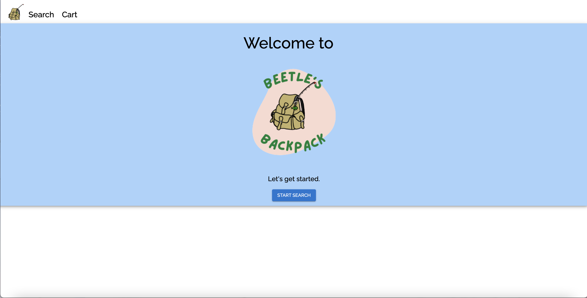
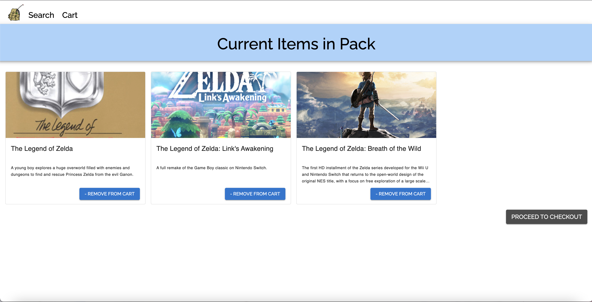
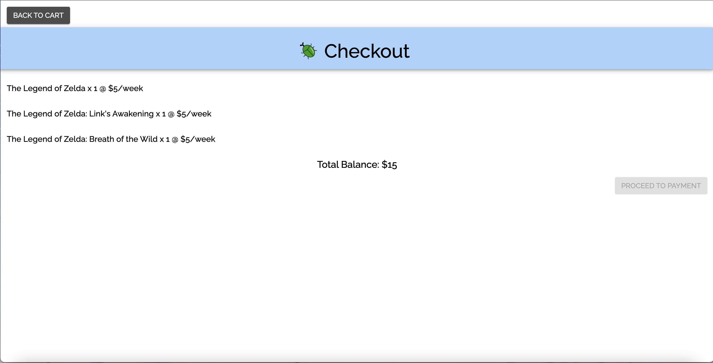

## Description:

A fake video game rental company that uses the Giant Bomb Api to search for video games and return results. Customers can add desired video games rentals (at $5 for 1 week) to their cart and proceed to the checkout page. Payment is disabled since this is a fake company and we wouldn't want to scam anyone.

## To Run:

- Change `GIANT_BOMB_KEY` to authentication tokens from Giant Bomb in `constants.ts`. I didn't include my personal keys because that seems like it could be a security thing.
- If you don't have yarn installed, install it using `brew install yarn` (given that you have homebrew installed)
- `yarn install` to install packages
- `yarn start` Run app locally.
- Turn off CORS in whatever browser you want to view this in. I used an extension on Google Chrome. On Safari go to preferences -> advanced -> show develop in toolbar, and then select Disable Cross Origin Restrictions

## Future Improvements:

...which I would make if I had more time

- expand for more info: add modal that pops out with additional information for each game
- combine cart & searchResults into generic GameList component
- persistent cart (refreshing the page saves cart)
- resolve CORS issue
- learn how to do cypress tests with redux because apparently I don't remember how to do that (or possibly take out redux)

## Current Look:

